# 开发提交作品路径
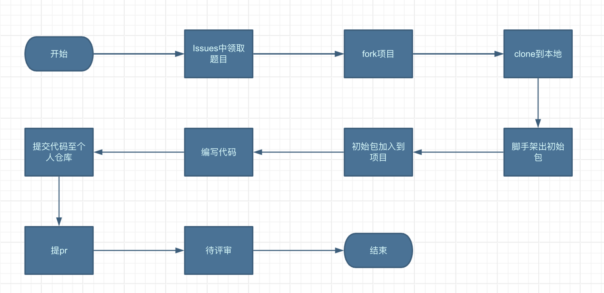

## 提交规范
### 结构规范（提交pr时自动效验）
#### 后端
项目中必须包含pom.xml文件。
项目中需包含README.md和依赖库使用文档说明.docx 这两个文件，格式参考附1。
项目需添加nasl-metadata-maven-plugin打包插件（当前版本1.3.0），并能使用mvn clean package命令打包。

#### 前端
项目中必须包含package.json文件。
components目录下必须包含component代码和声明。
能够使用npm install、npm run build打包。

### branch规范
分支命名应以Feature、Task或Bug作为前缀，中间跟随相应的issue编号，最后为描述，使用中划线分割，比如："Feature-78-transition"。
废弃的分支及时删除。

### PR规范
每次提交PR，只能包含一个依赖库的修改，如果涉及多个，需要分开多次提交。此外，每次提交只允许修改自己本文件夹下的文件，禁止修改其他文件夹中的文件。
提交项目需满足开发规范的项目结构。
提交PR的title应以Issue编号为作为前缀，中间跟随连接器或者依赖库，最后为简要的需求标题，使用中划线分割，如：为“85-依赖库-操作记录”， description为简要的项目介绍。

### Issue规范
Issue的title应以需求来源为作为前缀，中间跟随连接器或者依赖库，再跟需求、Task、Bug、FAQ，最后为简要的需求标题，如 "资产大赛2期——依赖库需求24：操作记录"，description格式为需求具体内容、奖励、负责人。无论是个人还是企业，都可以创建Issue。

## Issues中领取提取

低代码运营同学会在<https://github.com/netease-lcap/CodeWaveAssetCompetition2024/issues>发布依赖库主题。开发者在Issues中留言，获得回复后即表示领取成功。

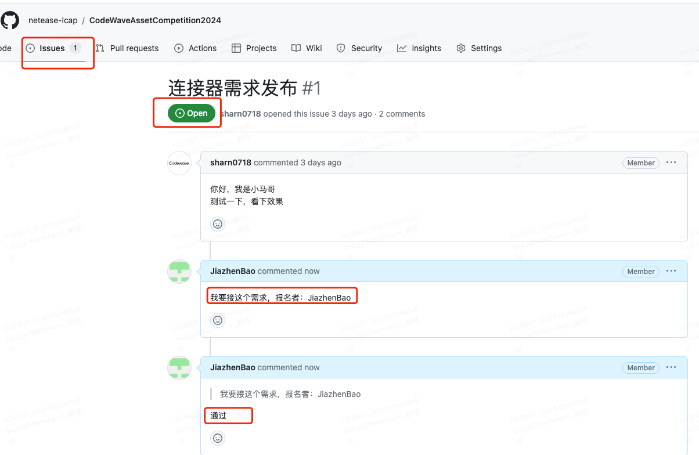

## Fork项目

<https://github.com/netease-lcap/CodeWaveAssetCompetition2024> 进入到项目主页，点击Fork按钮，在个人空间创建一个本项目的派生项目。

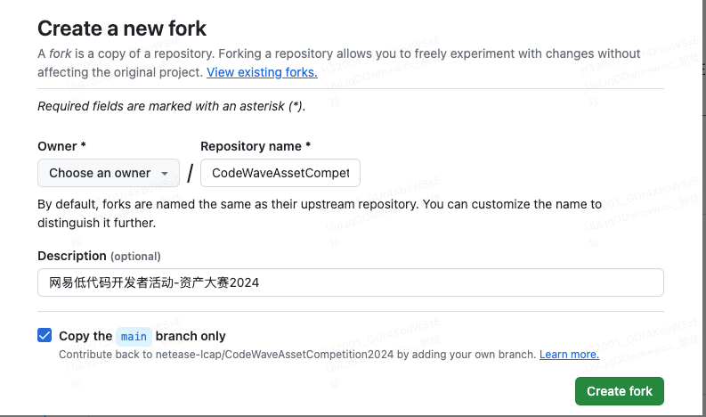

再点击Create fork按钮，创建

## Clone到本地

须本地已安装git环境。<https://git-scm.com/book/zh/v2/%E8%B5%B7%E6%AD%A5-%E5%AE%89%E8%A3%85-Git>

进入个人空间的CodeWaveAssetCompetition2024项目首页。点击Code按钮，获取git地址。

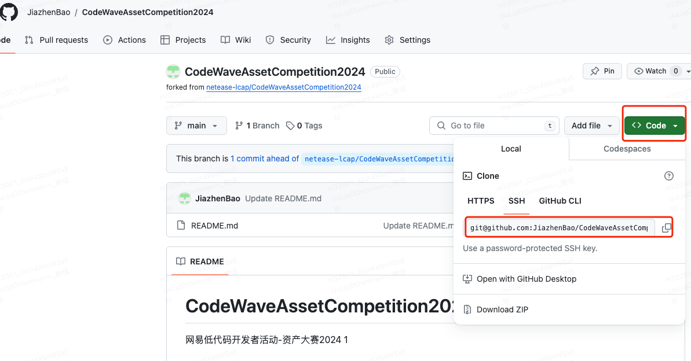

在本地执行git clone <git@github.com>\:JiazhenBao/CodeWaveAssetCompetition2024.git获取项目到本地。

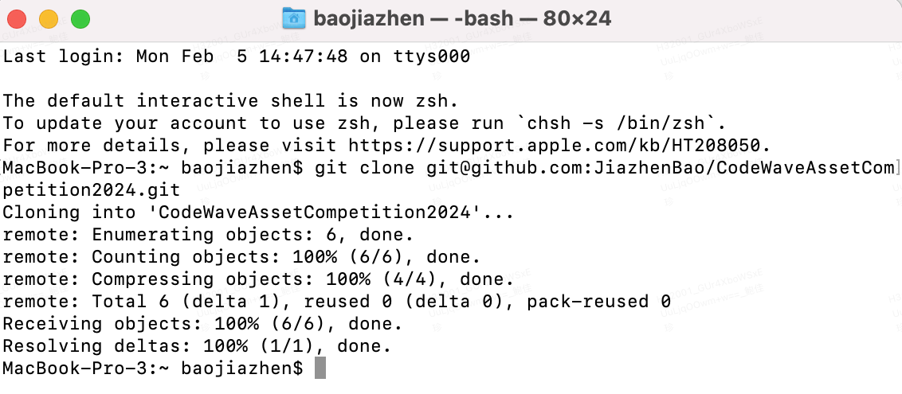

## Clone到本地

可以看到整个仓库的目录结构如下。

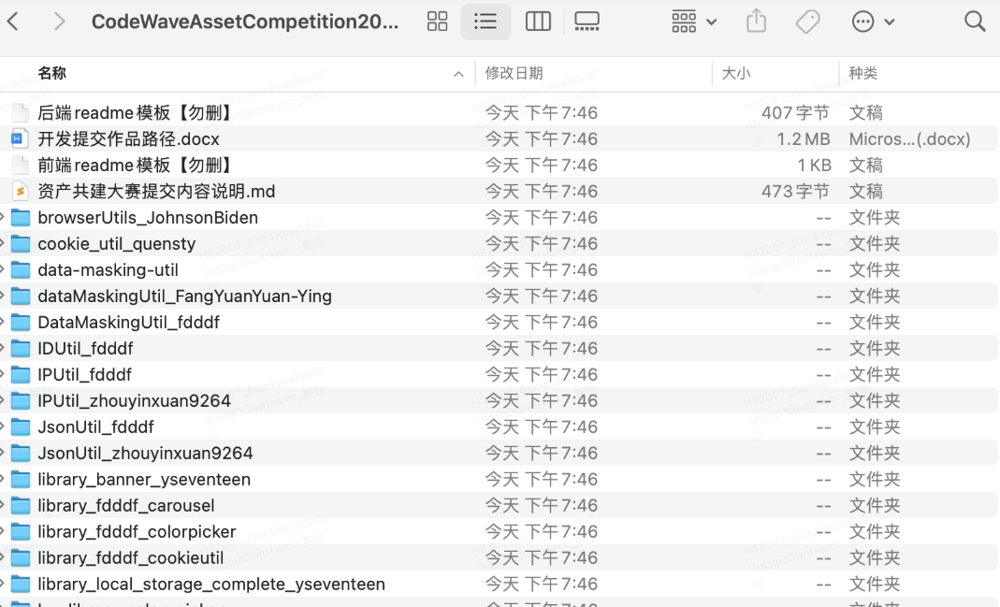

## 阅读资产共建大赛提交内容说明

1.  本次提交以PR方式提交
2.  需要包含项目原始工程(源码)
3.  源码工程中，除源码外，还要有README.md(说明)
4.  README.md参考如下

*   前端readme模板【勿删】
*   后端readme模板【勿删】

## 创建个人依赖库文件夹

请勿在此时对仓库中的其他文件进行任何操作，包括删除、修改、移动操作，以及对各类模板和其他依赖库的操作。这是因为Git记录的是文件系统的快照，它并不保存文件的变化，而是记录每次提交时文件系统的状态。因此，任何修改都会被Git识别并记录下来。

下图中test_library为个人依赖库文件夹。接下来的任何改动，都在test_library文件夹中进行。

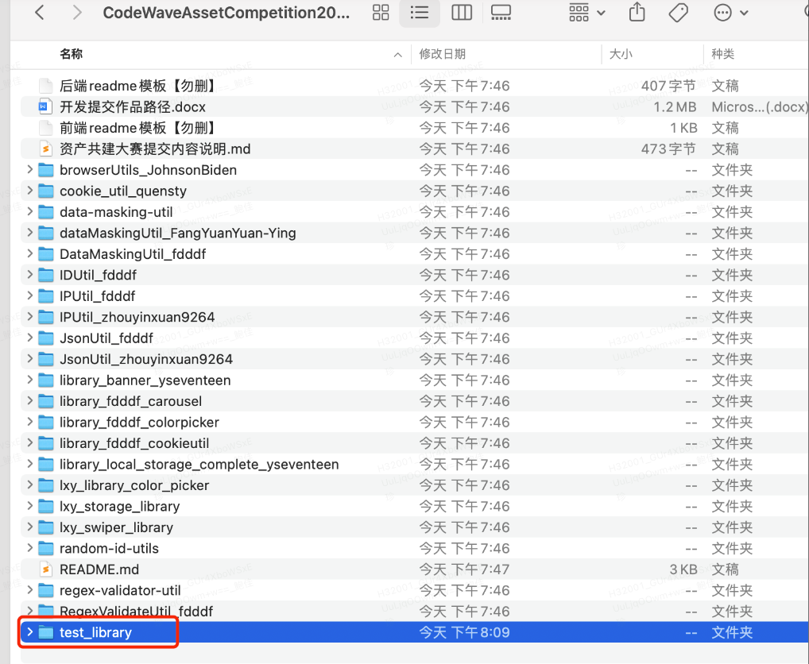

## 创建依赖库

### 后端

脚手架出初始包test\_library可以通过脚手架出包，直接复制到CodeWaveAssetCompetition2024目录下。

<https://libraryinitializr-community1.app.codewave.163.com/init> 在脚手架页面中，按需创建初始化项目。

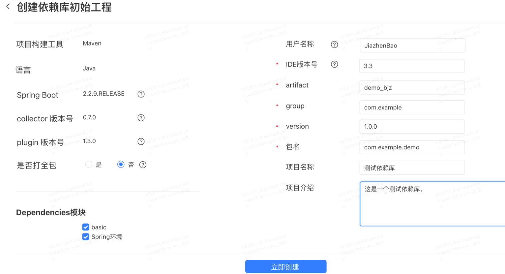

点击立即创建后，得到demo_bjz_JiazhenBao工程。

### 前端

前端依赖库可用官方提供的lcap脚手架创建，使用文档如下：

<https://community.codewave.163.com/CommunityParent/fileIndex?filePath=40.%E6%89%A9%E5%B1%95%E4%B8%8E%E9%9B%86%E6%88%90%2F10.%E6%89%A9%E5%B1%95%E5%BC%80%E5%8F%91%E6%96%B9%E5%BC%8F%2F20.%E5%89%8D%E7%AB%AF%E6%89%A9%E5%B1%95%E5%BC%80%E5%8F%91%2F10.%E5%89%8D%E7%AB%AF%E4%BE%9D%E8%B5%96%E5%BA%93%E5%BC%80%E5%8F%91%E5%BF%AB%E9%80%9F%E5%85%A5%E9%97%A8.md&version=3.6>

### 初始包和CodeWaveAssetCompetition2024结合

将demo_bjz_JiazhenBao初始包copy到和CodeWaveAssetCompetition2024目录下。

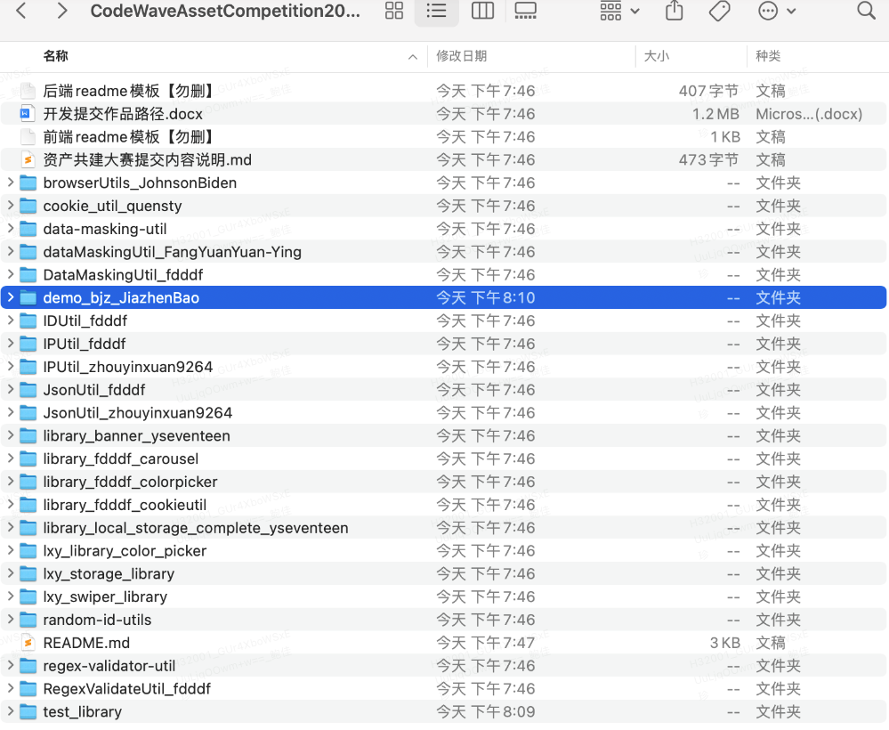

## 编写依赖库代码

在初始化项目中，编写自己的依赖库代码。

## 提交代码至个人仓库

提交的内容除项目工程外，还需要包括readme文档（按模板描述）、依赖库最终打包的zip包文件和依赖库使用文档。参考：<https://github.com/netease-lcap/CodeWaveAssetCompetition2024/blob/main/%E8%B5%84%E4%BA%A7%E5%85%B1%E5%BB%BA%E5%A4%A7%E8%B5%9B%E6%8F%90%E4%BA%A4%E5%86%85%E5%AE%B9%E8%AF%B4%E6%98%8E.md>

依赖库目录示例（以后端为例）如下：<https://github.com/netease-lcap/CodeWaveAssetCompetition2024/tree/main/demo_bjz_JiazhenBao>。

tips：README.md和依赖库使用文档说明.docx需要保持文件名称不动。后续我们会对提交的PR自动校验目录结构。

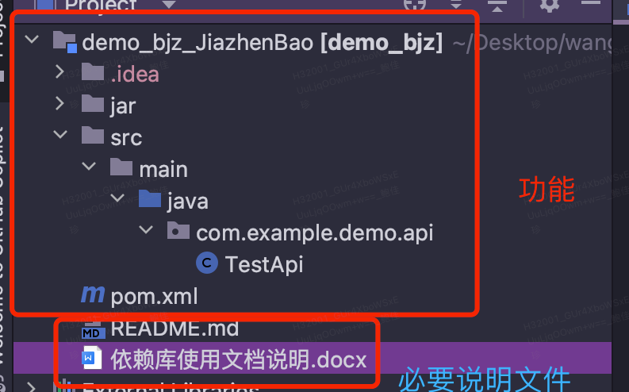

git checkout -b XXX

git status ---------------务必仔细查看本次提交更新了什么内容

git add XXX

git commit -m 'XXX'

git push origin XXX

## 提交PR

回到个人空间的派生项目工作区，点击Pull requests。可以看到Compare & pull request提示。点击Compare & pull request按钮。此时携带上次fork时的其他全部文件，不可对他们做删除操作。

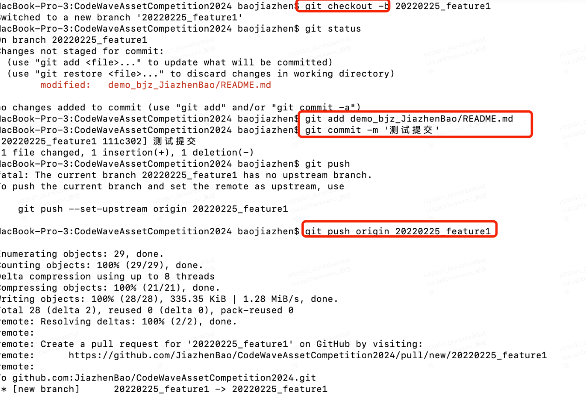

或者直接选择New pull request创建PR。

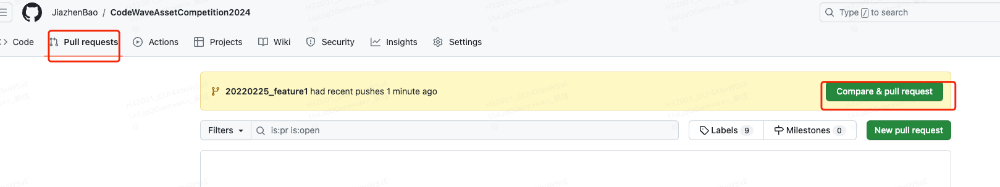

选择对应的仓库和分支。

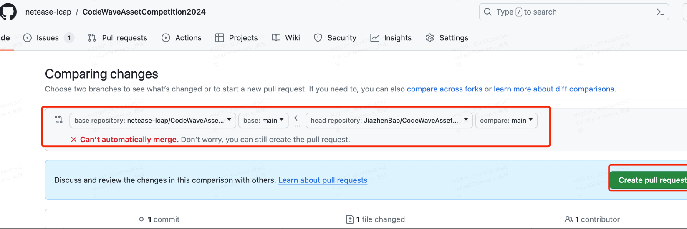

可以看到PR时的Comparing changes的文件，都是本次新增的个人依赖库文件夹下的文件。下图中个人依赖库文件夹名称为demo_bjz_JiazhenBao。

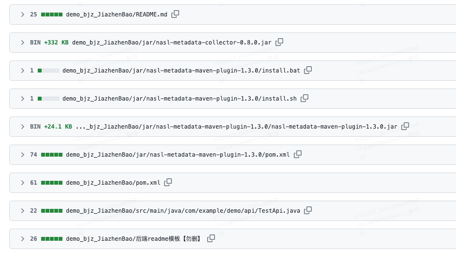

编辑本次PR的描述，用#关联对应的Issue。并Create pull request。等待审核。

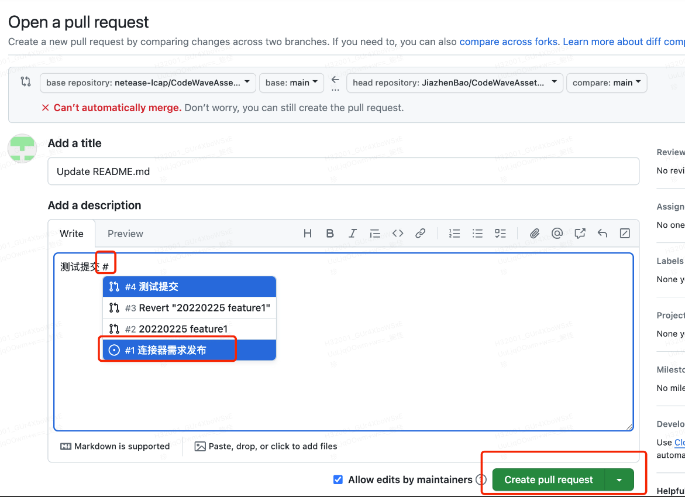

# fork后拉取主仓库的最新代码

## 进入到主项目

cd CodeWaveAssetCompetition2024/

## 首次执行时，添加上游仓库

只需首次执行，后续拉取最新代码时，不需要执行。

git remote add upstream <git@github.com>\:netease-lcap/CodeWaveAssetCompetition2024.git

## 拉取最新的上游仓库更新

git fetch upstream

## 切换到你的主分支（main）

git checkout main

## 合并上游仓库的更新到你的主分支

git merge upstream/main

## 解决冲突，推送到GitHub个人仓库

git push origin main
